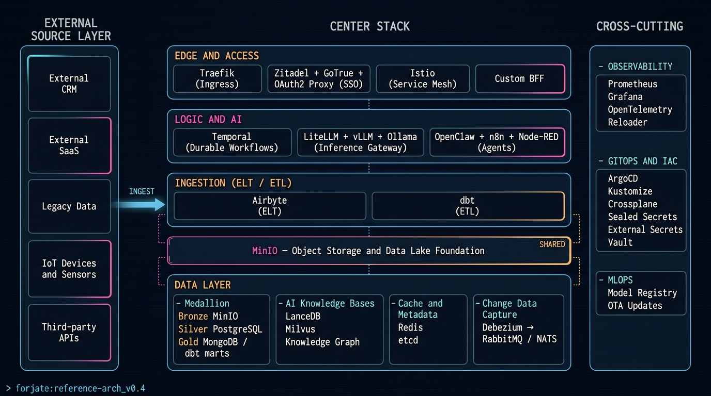
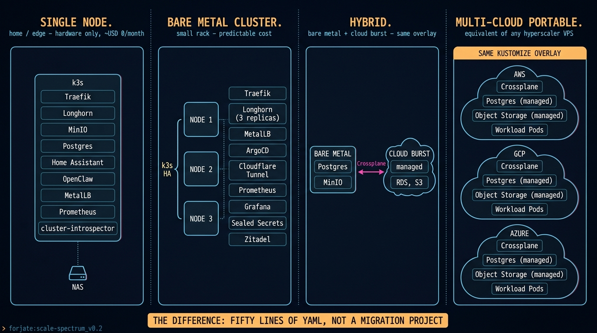
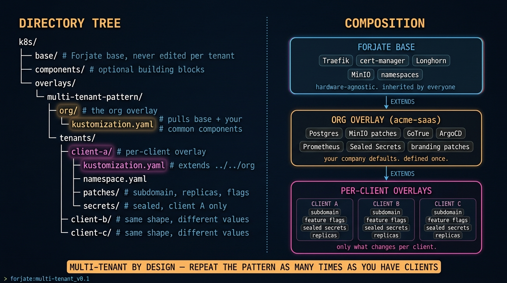
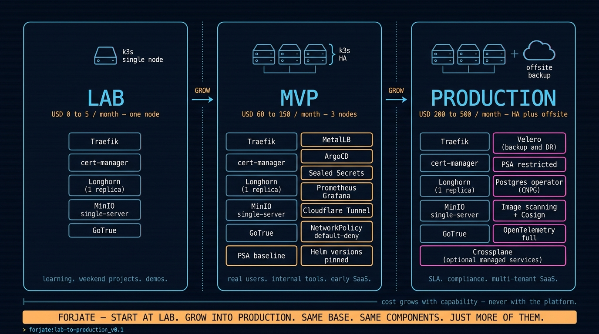

# Forjate

Your infra shouldn't be the thing stopping you from creating.

## The problem we kept hitting

For years, scaling a tech idea meant the same trap: **costs that nobody could predict**.

The cloud made it easy to start. It also made it easy to wake up to a bill three times what you modeled — because traffic spiked, because a job ran longer, because storage grew quietly in the background. The same platforms that let us ship fast also pulled data sovereignty out from under us. Audits started asking where the data physically lived. The answer was rarely simple.

This is not a story against hyperscalers. They solved real problems. They also created new ones: **unpredictable spend and a slow drift away from data sovereignty**. Forjate is an answer to those two, without giving up the speed.

## What Forjate is

A Kustomize-driven Kubernetes factory. Three concepts, no magic:

- **Base** — the services every tenant needs (Traefik, cert-manager, MinIO). Configured once. Longhorn is a recommended `components/apps/storage/` choice — most tenants want it, but a Pi cluster or a k3d laptop may not.
- **Components** — a catalog of 40+ optional building blocks. Databases, brokers, AI models, observability, auth, IaC connectors. Activate what you use.
- **Overlays** — your environment's config. Patches, secrets, hostnames. No duplication.

```
k8s/
├── base/          # Foundation. Everyone inherits this.
├── components/    # Catalog. Pick what you need.
└── overlays/      # Your environment. Customize without breaking.
```



## The "anywhere" promise

The same overlay runs on a Raspberry Pi, a rack of bare metal, AWS, GCP, Azure, or any mix of those. **The difference between a hyperscaler and a server in a closet is fifty lines of YAML, not a migration project.**

You move where the economics make sense. You keep the data where compliance requires it. You stop being held hostage by a single provider's pricing.



## Multi-tenant by design

Forjate is not just "shared base, separate overlays." The pattern recurses:

1. The **base** runs the foundation.
2. Your **org overlay** adds what your company always needs (your auth, your monitoring, your CDC).
3. A **client overlay** extends the org overlay with what's tenant-specific (their domain, their secrets, their data isolation).

Repeat as many times as you need clients, environments, or regions. The same recipe, composed.



## Real-world examples

**A B2B SaaS founder team running two production environments for ~USD 120/month.**
Full stack: dev + prod, end-to-end TLS, Istio for in-transit security, encryption at rest, CDC for compliance-grade audit trails. Same architecture they would have paid five figures for on a managed platform.

**A home lab on one Raspberry Pi and a household NAS.**
Home automation, IoT devices, integrated cameras, an OpenClaw-controlled agent, RBAC, Google auth. Production-grade ergonomics on hardware that fits on a shelf.

Same Forjate. Different overlays.

## Path to production

You don't have to leap. Start at **Lab** on a single node. Grow into **MVP** when real users show up. Tighten into **Production** when SLAs or compliance demand it. Same base, same components — just more of them.



Cost grows with capability, never with the platform. The full breakdown of what changes at each stage lives in [`docs/lab-to-production.md`](docs/lab-to-production.md).

## Component catalog

| Category | Components |
|----------|------------|
| AI & ML | Ollama, vLLM, LanceDB, Milvus, document processing |
| Databases | PostgreSQL, MariaDB, MongoDB, Redis, etcd |
| Brokers | RabbitMQ, NATS, Mosquitto |
| CDC | Debezium connectors (Postgres / Mongo / MariaDB → RabbitMQ / NATS) |
| Data Ingestion | **Airbyte** _(planned — connector-based ELT for batch + incremental sync)_ |
| Observability | Prometheus, Grafana, OTEL Collector, Reloader, Kubernetes Dashboard |
| Workflows | Temporal, n8n, Node-RED |
| Auth & Security | **Zitadel** _(SSO / IAM)_, GoTrue, OAuth2 Proxy, Vault, External Secrets, Sealed Secrets |
| Agents | `cluster-introspector` _(OpenClaw-compatible, read-only cluster observer)_ |
| Productivity | Affine, AppFlowy, Formbricks |
| Networking | MetalLB, Cloudflare Tunnel |
| GitOps & IaC | ArgoCD, **Crossplane** _(plugs the hyperscalers in declaratively when you need them)_ |
| Analytics & Surveys | analytics pipelines, surveys |
| Communication | messaging integrations |
| Home & Edge | Home Assistant, ESPHome |
| Storage | MinIO, Longhorn |
| Other | Docker registry, whoami |

**Bundles** are pre-wired component combinations. One exists today (Temporal + Postgres). More are coming.

## Quick start

```bash
# 1. Clone
git clone https://github.com/AItizate/forjate.git
cd forjate/k8s/overlays/quickstart

# 2. Spin up a local cluster
./01_init_cluster.sh

# 3. Deploy base + LiteLLM + Ollama + Gemma 3 1B (default)
./02_deploy.sh

# 4. Validate end-to-end and open a chat REPL against the model
./03_validate.sh
```

About five minutes end-to-end (default is Gemma 3 1B, ~815 MB). A local k3d cluster with LiteLLM in front of Ollama, answering OpenAI-compatible `/v1/chat/completions` calls — no external API keys, no OAuth, no cloud accounts. Tear it down with `./destroy.sh`. For a heavier multimodal model, prepend `OLLAMA_MODEL=gemma4:e2b-it-q4_K_M` to steps 3 and 4 (~20–30 min for the download).

For a richer local AI stack (auth, ingress, TLS, LiteLLM, Open WebUI, vLLM), see the [`ai-dev-stack`](k8s/overlays/ai-dev-stack/) overlay. It requires credentials, by design.

## Example overlays

| Overlay | What's inside | Use case |
|---------|---------------|----------|
| `quickstart` | LiteLLM (OpenAI-compatible gateway) → Ollama + Gemma 3 1B | Fresh-clone smoke test — base + the production gateway shape with one local backend, ~5 min end-to-end |
| `ai-dev-stack` | Base + OAuth2 + LiteLLM + vLLM + MinIO + Node-RED + Milvus | Local AI development cluster |
| `cdc-event-sourcing` | Base + MongoDB + RabbitMQ + Debezium CDC | Event-driven services with audit-grade change data capture |
| `agentic-orchestration` | Base + Temporal + MongoDB + worker | Multi-agent workflows, deterministic by Temporal |

Five additional reference overlays live in [`k8s/overlays/`](k8s/overlays/) with matching designs in [`docs/overlays/`](docs/overlays/): `agentic-simple-workflow`, `bare-metal-starter`, `home-edge-lab`, `multi-cloud-portable`, `multi-tenant-pattern`. All of them — and the four above — follow the [overlay convention](docs/overlays/CONVENTION.md).

## How it works

Kustomize handles everything. No templates, no magic variables.

```yaml
# Your overlay just says what it wants
resources:
  - ../../base
  - ../../components/apps/databases/postgres
  - ../../components/apps/ai-models/ollama
```

Want a different hostname? A patch. A new secret? An `.env` file. A new component? One line.

Remote tenants can consume the factory over SSH without living in this repo:

```yaml
resources:
  - ssh://git@github.com/AItizate/forjate.git//k8s/base?ref=v1.0.0
  - ssh://git@github.com/AItizate/forjate.git//k8s/components/apps/databases/postgres?ref=v1.0.0
```

Pin to a tag for stable rollouts. Move the tag forward when you're ready.

## Machine-readable wiki

Alongside `docs/` (prose for humans), the repo ships [`wiki/`](wiki/index.md) — a compiled, agent-maintained view of the whole factory: one page per component and overlay, with backlinks recording which overlays consume which component, plus hand-authored concept pages for the patterns no single directory shows.

It is an implementation of [Andrej Karpathy's LLM Wiki pattern](https://gist.github.com/karpathy/442a6bf555914893e9891c11519de94f), adapted for mutating sources: pages are compiled from `k8s/**` by `scripts/wiki-compile.py`, and `scripts/wiki-lint.py` fails CI when a page drifts behind the tree it describes. The rules live in [`wiki/SCHEMA.md`](wiki/SCHEMA.md).

## Who this is for

For anyone who'd rather create than fight infrastructure.

Side-project starting on a Raspberry. MVP shipping on a single VPS. Enterprise platform running across three clouds and a private rack. The barrier is the same: you should not have to rebuild your stack to change where it runs.

## Community

This is one more idea being shared. If it helps you create, great.

Organizations that spend their time fighting infra get left behind. The ones that create, win. Forjate is an attempt to lower that barrier.

Contributions welcome. Open an issue, send a PR, or just use it and tell us how it went.

## License

[Apache 2.0](LICENSE)
