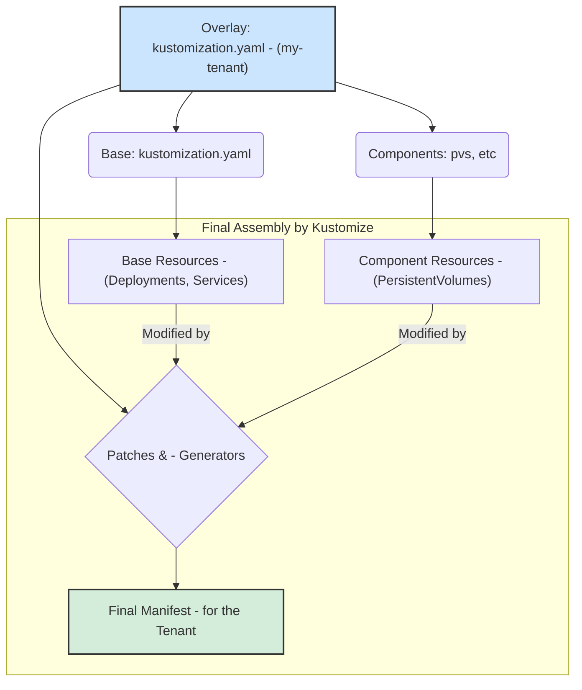

# IaC Architecture and Configuration Flow

This document provides a high-level overview of the `forjate` repository's architecture, explaining the design philosophy, directory structure, and Kustomize workflow.

## 1. Core Philosophy: Base + Overlays

The core of our Infrastructure as Code (IaC) strategy is built on Kustomize's `base` and `overlays` paradigm.

-   **Base (`k8s/base/`):** Contains a set of generic, reusable Kubernetes resources. These are the "blueprints" for our applications (Deployments, Services, etc.) without any environment-specific configuration. The base is environment-agnostic and must not contain details like hostnames, secrets, or replica counts.

-   **Overlays (`k8s/overlays/`):** An overlay takes the generic `base` and "overlays" it with specific configurations for a particular environment or tenant (e.g., `my-tenant`, `ai-dev-stack`). The overlay does not duplicate code; instead, it applies customizations through patches and generators for ConfigMaps and Secrets.

This approach allows us to maintain a DRY (Don't Repeat Yourself) codebase and manage multiple environments in a scalable and error-free way.

## 2. Repository Anatomy

Below is a breakdown of the directory structure and the purpose of each main component.

```
/
├── docs/                      # Project documentation.
├── k8s/
│   ├── base/                  # Catalog of base applications and configurations.
│   │   ├── apps/              # Individual applications (e.g., litellm, open-webui).
│   │   └── namespaces/        # Base namespace definitions.
│   ├── components/            # Reusable building blocks (e.g., PVs).
│   └── overlays/              # Overlays for each tenant or environment.
│       └── my-tenant/      # Example of a tenant overlay.
├── scripts/                   # Scripts to automate common tasks.

```

-   `k8s/base/`: The catalog of everything that can be deployed. Each application here is self-contained and functional in a generic sense.
-   `k8s/components/`: Reusable configuration pieces that are not full applications, such as different types of `PersistentVolumes` (e.g., `local-storage`, `nfs-storage`).
-   `k8s/overlays/`: The heart of customization. Each subdirectory here is a unique, deployable instance.
-   `scripts/`: Helper tools to facilitate the creation of new components or tenant management.

## 3. Anatomy of a Tenant (Overlay)

A tenant directory (e.g., `k8s/overlays/my-tenant/`) contains everything needed to customize the `base`.

-   `kustomization.yaml`: The brain of the overlay. It defines which `base` resources to use, which components to include, and which patches and generators to apply.
-   `configs/`: Contains configuration files (e.g., `litellm-config.yaml`) that will be injected into `ConfigMaps`.
-   `secrets/`: Contains environment files (`.env`) with sensitive values. Kustomize uses them to create Kubernetes `Secrets` securely.
-   `patches/`: Contains YAML snippets that modify the `base` resources. This is the primary mechanism for customization.
-   `namespaces/`: Allows for more granular organization and customization. A tenant can define sub-overlays per `namespace`, applying specific configurations only to the resources within that namespace.

## 4. The Kustomize Flow: Inheritance and Precedence

Kustomize builds the final Kubernetes manifest by following a hierarchy. The top-level `kustomization.yaml` (from the tenant overlay) is the entry point.

The flow works as follows:

1.  **Entry Point:** You run `kustomize build` on the overlay directory (e.g., `k8s/overlays/my-tenant`).
2.  **Load Base Resources:** The overlay's `kustomization.yaml` loads all resources specified in its `resources` section, which typically points to `../../base`.
3.  **Load Components:** If used, it loads reusable `components` (e.g., a storage configuration).
4.  **Apply Patches and Generators:** Kustomize applies the `patches`, `configMapGenerator`, and `secretGenerator` defined in the overlay. These **take precedence** over the base configuration. For example, a patch in the overlay can change a container's image, add an environment variable, or modify a label defined in the `base`.

This model enables a "pseudo-recursive" flow where the final configuration is a composition of the generic base and the specific customizations from the overlay, ensuring the tenant's configuration always has the final say.

### Conceptual Flow Diagram



## 5. Application Catalog and Integration

To understand in detail what each application in the `base` does and how they interact with each other, refer to the following documents:

-   **[Application Catalog](./apps/)**: A directory with a detailed explanation of each main component of the architecture (Traefik, Longhorn, LiteLLM, etc.).
-   **[Service Integration and Flows](./service-integration.md)**: A diagram and description of how the services collaborate to deliver complete functionalities, such as the authentication flow or requests to the AI stack.
