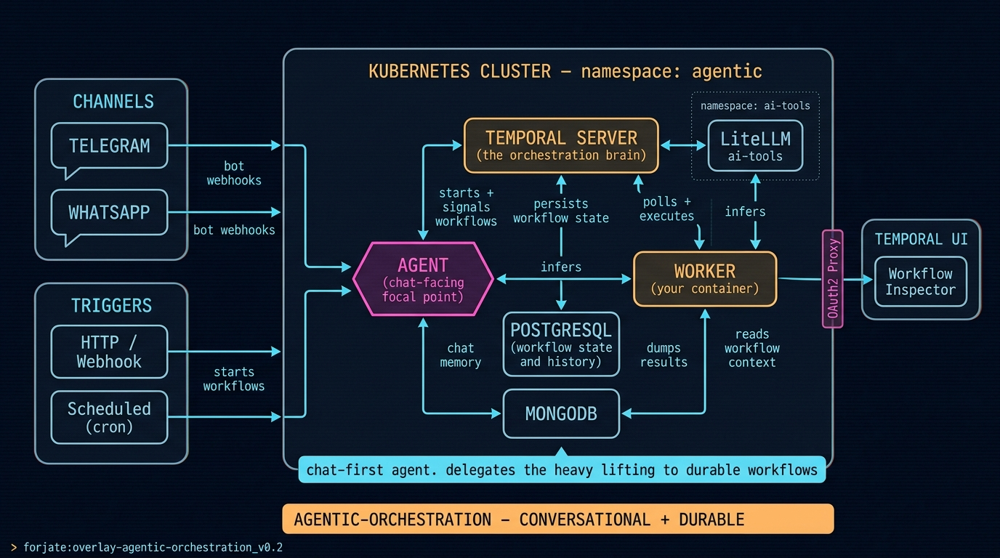

# Overlay: `agentic-orchestration`

> Conversational agent in front, durable workflows behind. Telegram or WhatsApp triggers an Agent that decides when to answer directly and when to hand off to Temporal.

## The situation

A simple chatbot is fine until the work matters. Then you need durability for the heavy lifting: every step persisted, every retry deterministic, every long-running task resumable. And you need a conversational surface that humans actually use — not an HTTP endpoint, but Telegram or WhatsApp.

This overlay shows the minimum infrastructure for **chat-first agents that lean on Temporal for durable execution**. An `AGENT` container takes messages from chat channels, decides what to do, and either answers directly via LiteLLM or starts a Temporal workflow for the kind of work that needs to survive restarts. A `WORKER` container polls Temporal and executes the registered workflows.

You reach for this overlay when the question is *"a human starts a conversation, the agent has to do real work that might take an hour, and nobody can lose state if a pod restarts"*.

## Architecture



## Two entry paths

| Path | Reaches | Use case |
|------|---------|----------|
| **CHANNELS** — Telegram / WhatsApp bot webhooks | AGENT | Conversational interactions, ad-hoc requests, ongoing chats with state |
| **TRIGGERS** — HTTP / Webhook / cron | TEMPORAL SERVER directly | Scheduled batch jobs, integrations from other systems, anything not conversational |

The AGENT is the **focal point** for human interaction. It decides whether a request is small enough to answer in-line (one inference + a write to MongoDB) or whether it needs to delegate to a durable Temporal workflow.

## Components used

| Component | Role |
|-----------|------|
| Custom `agent` Deployment (your container) | The chat-facing focal point. Receives webhooks from Telegram + WhatsApp, holds chat memory in MongoDB, calls LiteLLM, signals Temporal |
| `components/bundles/temporal-stack` | Pre-wired Temporal server + Postgres bundle |
| Custom `temporal-worker` Deployment (your container) | Polls Temporal and executes the registered workflows, activities, and skills |
| `apps/databases/mongodb` | Shared document store — AGENT writes chat memory, WORKER dumps workflow outputs |
| LiteLLM (from base, `ai-tools` namespace) | LLM gateway shared by AGENT and WORKER |
| `apps/security/oauth2-proxy` + `apps/auth/gotrue-auth` (via base) | Auth in front of the Temporal UI |

The overlay lives in the `agentic` namespace; LiteLLM is in the shared `ai-tools` namespace.

## `kustomization.yaml`

```yaml
# root
resources:
  - ../../base
  - ./namespaces/agentic

# namespaces/agentic/kustomization.yaml
resources:
  - namespace.yaml
  - ../../../../components/bundles/temporal-stack
  - ../../../../components/apps/databases/mongodb
  - agent-deployment.yaml
  - worker-deployment.yaml

secretGenerator:
  - name: postgres-secret
    envs: [secrets/postgres.env]
  - name: mongodb-secret
    envs: [secrets/mongodb.env]
  - name: agent-secret
    envs: [secrets/agent.env]      # bot tokens, etc.
  - name: worker-secret
    envs: [secrets/worker.env]
```

## The agent + worker contract

You ship two containers. They have different jobs:

### AGENT (`agent-deployment.yaml`)

Exposes webhook endpoints for each chat channel and reads a config of how to interpret messages. Connects to:

- `litellm.ai-tools.svc.cluster.local:4000` — for direct inference
- `mongodb.agentic.svc.cluster.local:27017` — for chat memory and agent state
- `temporal-server.agentic.svc.cluster.local:7233` — to **start** or **signal** workflows when a request needs durable execution

Typical decision: short-Q&A → answer directly with one LiteLLM call. Multi-step research, batch processing, anything that takes more than a few seconds → start a workflow.

### WORKER (`worker-deployment.yaml`)

Polls Temporal and executes the registered workflows. Connects to:

- `temporal-server:7233` — polls task queues, executes workflows + activities
- `litellm.ai-tools.svc.cluster.local:4000` — for inference inside activities
- `mongodb` + `postgres` — workflow context, output dumps

The WORKER is where your workflow Python/Go/TypeScript SDK code lives. You register workflows + activities + signals; Temporal feeds it work.

## Notes

- **Why split AGENT and WORKER**: AGENT optimizes for low latency (chat reply in <2s). WORKER optimizes for throughput and durability (workflows that take minutes to hours). Same image is possible but mixing them hides the resource and scaling trade-offs.
- **Channel webhooks bypass OAuth2 Proxy** — the bot tokens are the auth. The Temporal UI does sit behind OAuth2 Proxy for human operators.
- **Why Temporal over a simple queue**: Temporal gives you exactly-once execution semantics for multi-step flows, deterministic replay for debugging, resumability across pod restarts, and a UI to inspect every step of every run. Worth the footprint when work is non-trivial.
- **MongoDB shared by both, on purpose**: AGENT writes chat memory and persona state; WORKER dumps workflow outputs (research notes, generated artifacts). Same collection space, namespaced by document type. If the volume justifies it later, split into two MongoDB instances.
- **One worker, many workflows**: a single `temporal-worker` Deployment can host dozens of registered workflows. Scale by adding replicas, not by adding deployments.
- **No conversational entry?** If you only need scheduled or webhook-triggered durable workflows (no chat), the CHANNELS box and AGENT are optional — TRIGGERS hits Temporal directly. The overlay still works.
- **No durable workflows for your tenant?** Drop down to [`agentic-simple-workflow`](./agentic-simple-workflow.md) — same AGENT shape, no Temporal, fewer moving parts.
- **Production graduation path**: at scale, swap the in-cluster Postgres for a managed instance (CloudNativePG or RDS via Crossplane). The Temporal stack itself doesn't change.
