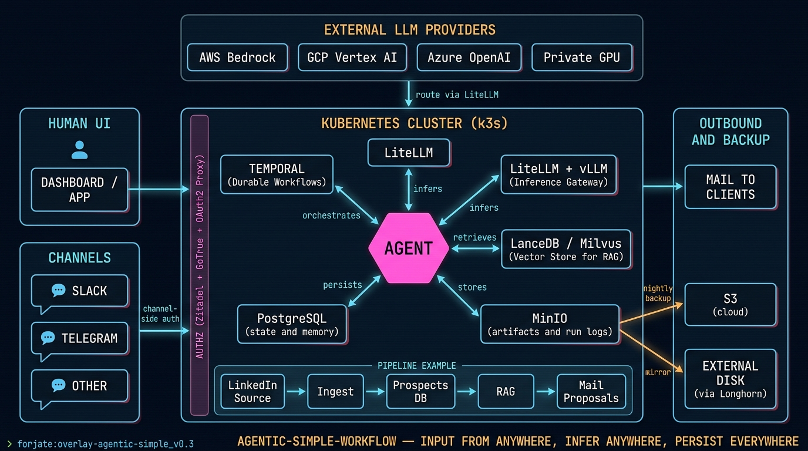

# Overlay: `agentic-simple-workflow`

> The smallest production-shaped overlay that still runs real agentic work.

## The situation

A small team needs a single agent that processes incoming work, calls an LLM, writes results to a database, and exposes a thin HTTP surface. They do not need durable workflows yet, they do not need a vector store, they do not need a service mesh. They need: a database, an object store, the agent, and a way to reach it.

This overlay is the floor for that — an honest "hello world" for the agentic side of Forjate.

## Architecture



## Components used

| Component | Why |
|-----------|-----|
| `apps/databases/postgres` | Application state and the agent's working memory |
| `apps/minio` | Object storage for prompts, artifacts, and run logs |
| `apps/ai-models/ollama` _or_ external LLM gateway | The inference layer — local for cost control, swappable for an API |
| `apps/auth/gotrue-auth` | One auth surface for the agent's HTTP routes |
| `apps/sealed-secrets` | API keys for the LLM provider, DB passwords, OAuth client secrets |

The agent application itself is your own container image referenced from a patch in the overlay.

## `kustomization.yaml`

```yaml
apiVersion: kustomize.config.k8s.io/v1beta1
kind: Kustomization

namespace: agent

resources:
  - ../../base
  - ../../components/apps/databases/postgres
  - ../../components/apps/minio
  - ../../components/apps/ai-models/ollama
  - ../../components/apps/auth/gotrue-auth
  - ../../components/apps/sealed-secrets
  - ./agent-deployment.yaml
  - ./agent-ingress.yaml

patches:
  - path: patches/postgres-storage-size.yaml
    target:
      kind: StatefulSet
      name: postgres

configMapGenerator:
  - name: agent-config
    files:
      - configs/agent.toml

secretGenerator:
  - name: agent-secrets
    envs:
      - secrets/agent.env
```

## Notes

- Postgres replicas at 1 by default — fine for a single agent, bump it for HA.
- Ollama lives in-cluster for predictable cost. Swap for a remote LLM gateway when the model footprint outgrows your node.
- This overlay does not include Temporal — graduate to `agentic-orchestration` when workflows need to be durable across restarts.
- Backups: schedule pg_dump → MinIO via a `CronJob` in the overlay. Restore is `pg_restore` from MinIO. No external dependency.
