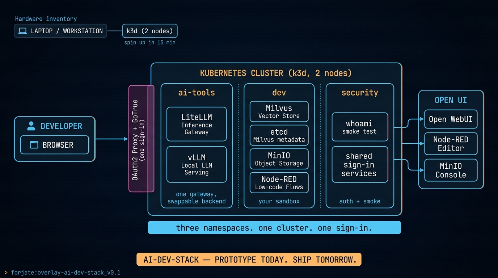

# Overlay: `ai-dev-stack`

> A laptop-class AI development cluster — local LLMs, vector store, low-code flow, all behind one sign-in.

## The situation

You want to build with an AI stack — RAG, agent prototypes, low-code automations — without paying inference per token, without leaking your data to a hosted gateway, and without spending a sprint wiring TLS, auth, and storage every time.

This overlay gives you a k3d-based local cluster where you can stand up the whole AI workbench in fifteen minutes. It targets your laptop or a workstation. It's the overlay you grab when the question is *"can I prototype this idea today?"*.

## Architecture



## Components used

| Component | Why it's here |
|-----------|---------------|
| `apps/ai-models/vllm` | High-throughput LLM inference, exposed under `ai-tools` namespace |
| `apps/ai-models/litellm` | Single gateway routing to vLLM locally — same shape used by `agentic-orchestration` |
| `apps/ai-models/open-webui` | Chat UI in front of LiteLLM |
| `apps/storage/longhorn` | Replicated block storage for the StatefulSets in this overlay |
| `apps/databases/milvus` + `apps/databases/etcd` | Vector store for embeddings + the metadata backend Milvus needs |
| `apps/minio/single-server` | Object storage for model artifacts, run logs, RAG documents |
| `apps/node-red` | Low-code flow runtime for stitching tools, agents, webhooks |
| `apps/whoami` | Example app that proves the ingress + auth pipeline is alive |
| `apps/security/oauth2-proxy` (via base) + `apps/auth/gotrue-auth` (via base) | One sign-in surface in front of every UI |

The overlay composes **three namespaces** (`ai-tools`, `dev`, `security`), each as its own sub-kustomization under `namespaces/`. The Advanced tier per-namespace pattern lives here in its purest form.

## `kustomization.yaml`

```yaml
resources:
  - ../../base
  - selfsigned-issuer.yaml
  - ./namespaces/security
  - ./namespaces/dev
  - ./namespaces/ai-tools

configMapGenerator:
  - name: litellm-config-file
    namespace: ai-tools
    files:
      - config.yaml=configs/litellm-config.yaml
    behavior: replace

secretGenerator:
  - name: oauth2-proxy-secret
    namespace: security
    envs: [secrets/oauth2-proxy.env]
  - name: litellm-secret
    namespace: ai-tools
    envs: [secrets/litellm.env]
  # ... and one secret per namespace that needs it
```

The root `kustomization.yaml` is thin; the heavy lifting lives in each `namespaces/<ns>/kustomization.yaml`.

## How to run it

```bash
cd k8s/overlays/ai-dev-stack
./01_init_cluster.sh   # spins up a 2-node k3d cluster
./02_deploy.sh         # applies the overlay + bootstraps Helm dependencies
```

Tear it down:

```bash
./destroy_cluster.sh
```

## Notes

- **vLLM resource budget**: vLLM wants real GPU when you're serving big models. On a laptop without GPU, the overlay still builds — you'll just want to swap vLLM for Ollama or point LiteLLM at a remote provider. The component slot stays the same.
- **Local-only by default**: `selfsigned-issuer.yaml` keeps cert-manager out of Let's Encrypt for a local k3d run. If you bring this overlay to a real cluster, swap it for the Let's Encrypt issuer in `base/`.
- **Why three namespaces, not one**: each namespace has a distinct ownership boundary — `ai-tools` is "anything the LLM gateway touches", `dev` is "your sandbox" (Milvus, MinIO, Node-RED), `security` is shared auth. Cross-namespace traffic is intentional and minimal.
- **First read of a tenant pattern**: this overlay is also a good reference for the per-namespace structure described in [`CONVENTION.md`](./CONVENTION.md) — see how each sub-kustomization owns its secrets and patches.
- **Migration path**: when you outgrow laptop, swap the k3d bootstrap (`01_init_cluster.sh`) for a real cluster bootstrap and the rest of the overlay carries over unchanged.
