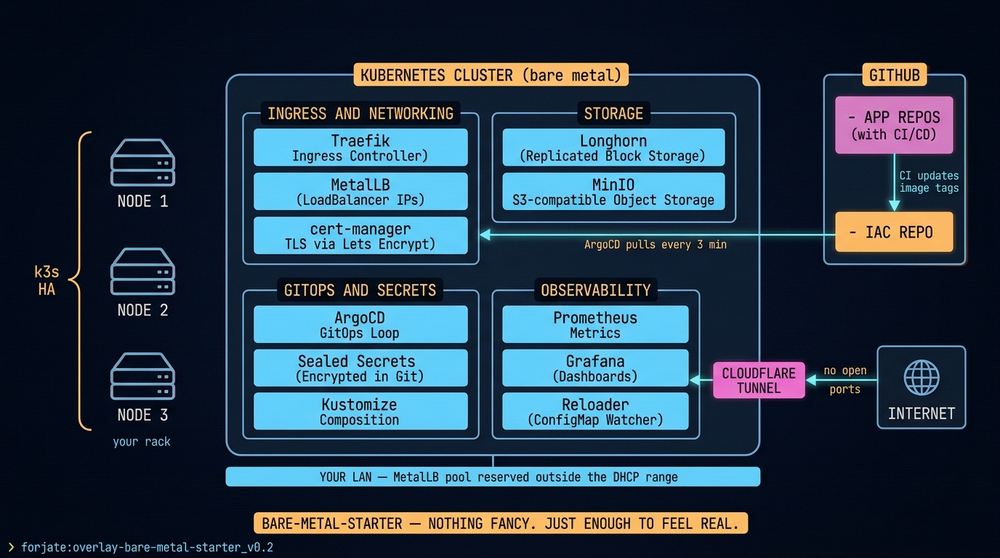

# Overlay: `bare-metal-starter`

> The first serious bare-metal cluster. Nothing fancy — just enough to feel real.

## The situation

You own (or rent) two or three small servers. Maybe a mini-PC and an old workstation. You want a cluster you can put real services on, with TLS, persistent storage, a load balancer, and a safe way to expose it. No cloud account.

`bare-metal-starter` is the overlay that turns that pile of metal into something you can confidently deploy to.

## Architecture



## Components used

| Component | Why on bare metal |
|-----------|-------------------|
| `base/` | Traefik + cert-manager + Longhorn + MinIO are already what you need |
| `apps/networking/metallb` | LoadBalancer Services without a cloud — assigns IPs from a pool you own |
| `apps/cloudflare-tunnel` | Expose specific services to the public internet without opening firewall ports |
| `apps/sealed-secrets` | Commit secrets to git, encrypted, controller-decrypts at runtime |
| `apps/monitoring/prometheus` + `grafana` | Watch node health, disk, network — bare metal punishes you without monitoring |
| `apps/continuous-delivery/argocd` | GitOps loop — push to git, the cluster catches up |

## `kustomization.yaml`

```yaml
apiVersion: kustomize.config.k8s.io/v1beta1
kind: Kustomization

namespace: default

resources:
  - ../../base
  - ../../components/apps/networking/metallb
  - ../../components/apps/cloudflare-tunnel
  - ../../components/apps/sealed-secrets
  - ../../components/apps/monitoring/prometheus
  - ../../components/apps/monitoring/grafana
  - ../../components/apps/continuous-delivery/argocd
  - ./metallb-pool.yaml
  - ./cloudflare-tunnel-config.yaml

patches:
  - path: patches/longhorn-replica-count.yaml
  - path: patches/traefik-acme-staging.yaml
```

## Notes

- Use **k3s** for small clusters (1–5 nodes). Move to k3s HA or RKE2 when you need control-plane redundancy.
- Set Longhorn replica count to `min(nodes, 3)` — the default `3` will block scheduling on a 2-node cluster.
- Start Traefik / cert-manager against Let's Encrypt **staging** first. Switch to prod after you confirm DNS-01 or HTTP-01 challenges resolve.
- MetalLB needs a contiguous IP range on the LAN that your router does NOT hand out via DHCP. Document it in `metallb-pool.yaml`.
- Cloudflare Tunnel is optional but unlocks "I can reach my services from anywhere" without exposing ports — a much smaller attack surface than port-forwarding.

## Migration path

Once this overlay is stable, you usually want one of three next steps:

- Add a database + an app → looks like [`agentic-simple-workflow`](./agentic-simple-workflow.md).
- Add multiple clients → adopt [`multi-tenant-pattern`](./multi-tenant-pattern.md).
- Burst to a cloud provider for spikes → adopt [`multi-cloud-portable`](./multi-cloud-portable.md) with Crossplane.
