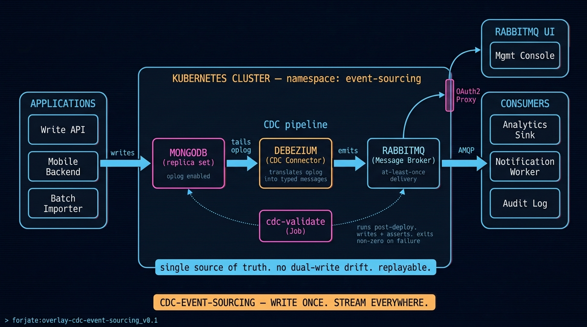

# Overlay: `cdc-event-sourcing`

> Change Data Capture from MongoDB into RabbitMQ. Auditable, replayable, downstream-friendly.

## The situation

Two systems and a regulator walk into a bar. The first wants to mutate documents in MongoDB at speed. The second wants every change as a stream of events so it can react in real time. The regulator wants every mutation accounted for, forever.

The classic answer is dual-write — and the classic problem is that the two writes drift. This overlay sidesteps that with **Change Data Capture**: Debezium watches MongoDB's oplog and emits every change into RabbitMQ as a structured event. The application only writes once. The event stream is the single source of truth for everything downstream.

## Architecture



## Components used

| Component | Role |
|-----------|------|
| `apps/databases/mongodb` + `apps/databases/mongodb/replica-set` | MongoDB with a replica set — required so Debezium can read the oplog |
| `apps/brokers/rabbitmq` | Event broker; receives every change as a typed message |
| `apps/cdc/debezium-mongo-rabbitmq` | The CDC connector — translates oplog entries into RabbitMQ messages |
| `apps/storage/longhorn` | Replicated block storage for the StatefulSets in this overlay |
| Validation Job (`cdc-validate-job.yaml`) | Post-deploy smoke test: writes to Mongo, asserts the message lands in RabbitMQ |
| `apps/security/oauth2-proxy` + `apps/auth/gotrue-auth` (via base) | Auth in front of the RabbitMQ management UI |

The overlay lives in the `event-sourcing` namespace. Everything that participates in the CDC pipeline (source, connector, sink) sits in one namespace so the connector can talk to both ends without crossing namespace boundaries.

## `kustomization.yaml`

```yaml
# root
resources:
  - ../../base
  - selfsigned-issuer.yaml
  - ./namespaces/event-sourcing

# namespaces/event-sourcing/kustomization.yaml
resources:
  - namespace.yaml
  - ../../../../components/apps/databases/mongodb
  - ../../../../components/apps/brokers/rabbitmq
  - ../../../../components/apps/cdc/debezium-mongo-rabbitmq
  - cdc-validate-job.yaml

components:
  - ../../../../components/apps/databases/mongodb/replica-set

secretGenerator:
  - name: mongodb-secret
    envs: [secrets/mongodb.env]
  - name: rabbitmq-secret
    envs: [secrets/rabbitmq.env]
  - name: debezium-mongo-rabbitmq-secret
    envs: [secrets/debezium.env]
  - name: mongodb-keyfile
    files: [keyfile=secrets/mongodb-keyfile]
```

## The validation job

`cdc-validate-job.yaml` is what makes this overlay trustworthy at deploy time. It runs once after apply and verifies the whole pipeline end-to-end:

1. Waits for MongoDB to accept connections.
2. Waits for the replica set to initialize.
3. Confirms RabbitMQ is up and the exchange exists.
4. Confirms the Debezium connector is registered and connected.
5. Writes a test document into MongoDB.
6. Asserts a corresponding message arrives in RabbitMQ within a deadline.
7. Cleans up the test document.

Read the Job's logs after deploy:

```bash
kubectl -n event-sourcing logs job/cdc-validate -f
```

A `[PASS]` count equal to the test count means the overlay is producing events end-to-end. Any `[FAIL]` line tells you exactly which step broke.

This is the pattern Advanced-tier overlays adopt across the catalog ([CONVENTION.md](./CONVENTION.md) §14).

## Notes

- **Why a replica set, not standalone Mongo**: Debezium needs the oplog, and the oplog only exists once Mongo is in a replica set. The `replica-set` component handles the init.
- **Other source DBs**: the catalog ships `debezium-{postgres,mariadb}-{rabbitmq,nats}` variants. Swap the connector component if you need to capture from Postgres or MariaDB, or sink to NATS instead of RabbitMQ.
- **At-least-once semantics**: Debezium guarantees at-least-once delivery. Consumers must be idempotent (use the Mongo document `_id` or the timestamp as a dedupe key).
- **Schema evolution**: a Mongo document is freeform — Debezium emits whatever's in the document. Downstream consumers should treat each event's payload as untyped JSON and version their interpretation of it explicitly.
- **Throughput envelope**: this overlay is sized for moderate event rates (low thousands per second). For higher rates, scale RabbitMQ via clustering and consider Kafka as the sink (a new `cdc/debezium-mongo-kafka` connector would be the natural next component).
