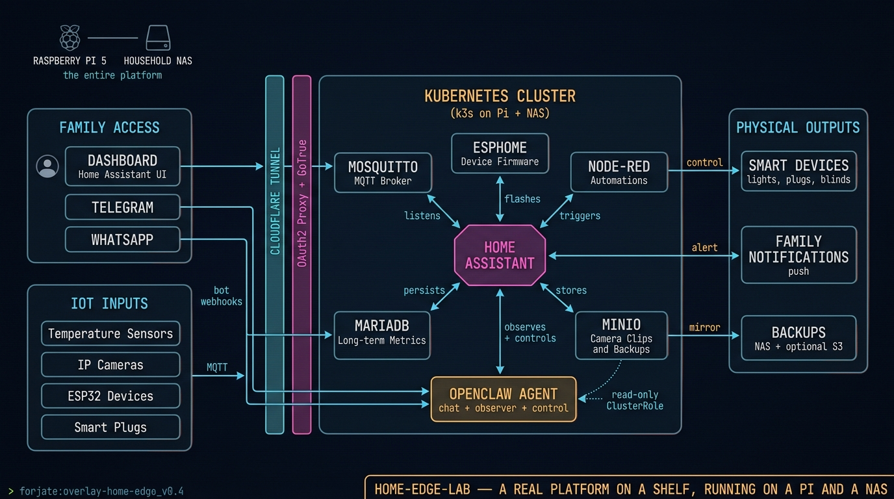

# Overlay: `home-edge-lab`

> The same architecture, on a Raspberry Pi and a household NAS.

## The situation

A house. A Raspberry Pi 5 sitting on a shelf. A NAS in a closet. The owner wants home automation, IoT devices, cameras feeding an agent, Google sign-in for the family, and role-based access so the kids don't accidentally turn off the heating. They want it to feel like a real platform — version-controlled, restorable, observable — without ever leaving the local network unless they explicitly say so.

This overlay shows that the same Forjate pattern that runs a multi-cloud SaaS can also live on consumer hardware.

## Architecture



## Components used

| Component | Role at home |
|-----------|--------------|
| `apps/home-automation/home-assistant` | The brain of the house — devices, automations, dashboards |
| `apps/home-automation/esphome` | Firmware for custom ESP32 / ESP8266 devices |
| `apps/brokers/mosquitto` | MQTT broker for IoT sensor traffic |
| `apps/node-red` | Visual rule chains for IoT and camera events |
| `apps/databases/postgres` | Long-term metric and event storage for HA |
| `apps/minio` | Object store for camera clips and HA backups |
| `apps/auth/gotrue-auth` + `apps/security/oauth2-proxy` | Google sign-in in front of every public endpoint |
| `apps/networking/metallb` | Local load balancer for the Pi + NAS pair |
| `apps/cloudflare-tunnel` | Optional — expose specific services externally without opening ports |
| `apps/monitoring/prometheus` + `grafana` | Power, network, container health |
| `apps/agents/cluster-introspector` | OpenClaw-compatible agent with read-only ClusterRole over the cluster — observes the house's own infra |
| _(future)_ [`agent-openclaw`](https://github.com/AItizate/agent-openclaw) | The agent gateway (image source for `cluster-introspector` and other agent roles) |

RBAC is handled at the cluster level — see `k8s/components/rbac/` for the `readonly` / `developer` / `agent` cluster roles. Bind each Google identity to the right role in the overlay.

## `kustomization.yaml`

```yaml
apiVersion: kustomize.config.k8s.io/v1beta1
kind: Kustomization

namespace: home

resources:
  - ../../base
  - ../../components/apps/home-automation/home-assistant
  - ../../components/apps/home-automation/esphome
  - ../../components/apps/brokers/mosquitto
  - ../../components/apps/node-red
  - ../../components/apps/databases/postgres
  - ../../components/apps/minio
  - ../../components/apps/auth/gotrue-auth
  - ../../components/apps/security/oauth2-proxy
  - ../../components/apps/networking/metallb
  - ../../components/apps/cloudflare-tunnel
  - ../../components/apps/monitoring/prometheus
  - ../../components/apps/monitoring/grafana
  - ../../components/rbac
  - ./role-bindings.yaml
  - ./cameras-ingress.yaml

patches:
  - path: patches/lightweight-replicas.yaml
  - path: patches/nas-pv-paths.yaml

secretGenerator:
  - name: google-oauth
    envs:
      - secrets/google-oauth.env
  - name: cloudflare-tunnel
    envs:
      - secrets/cloudflare.env
```

## Notes

- Run **k3s** on the Pi as the single control plane node. Add the NAS as a worker if it supports k3s, or as an NFS source for Longhorn / local-path-provisioner.
- Cameras stay on the LAN — Cloudflare Tunnel only exposes the HA dashboard and the agent's chat endpoint.
- The `agent` ClusterRole from `components/rbac/` is what you bind to the OpenClaw service account so it can read sensors and call automations but not change deployments.
- This whole stack idles under 4 GB of RAM and a few watts on a Pi 5 — leave headroom for the agent and Home Assistant's add-ons.
- Backups: PVC snapshots on the NAS + nightly `pg_dump` to MinIO. Restore is a single `kustomize build | kubectl apply` away.
