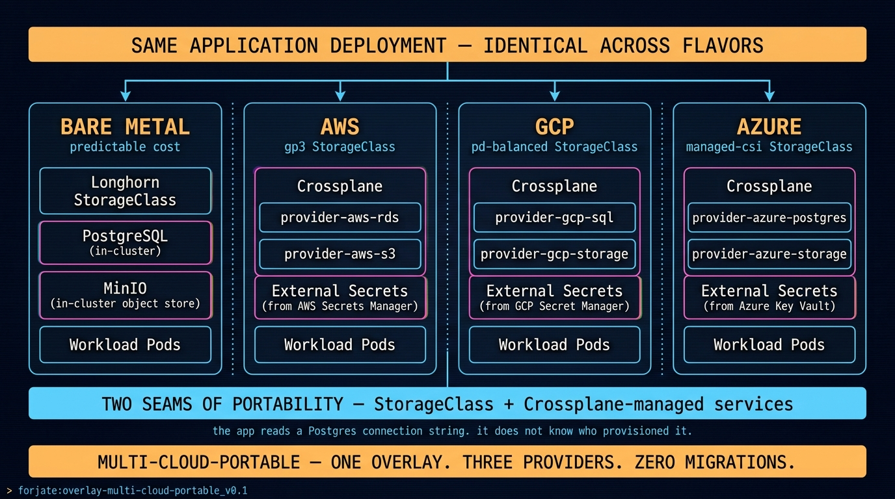

# Overlay: `multi-cloud-portable`

> One overlay. Three providers. Zero "migrations."

## The situation

You have a workload that currently runs on bare metal. A customer in another region asks for low latency, so a slice of the deployment needs to live on AWS. Another customer requires data residency in GCP. The team's reaction shouldn't be "we need to fork the infra." It should be "we change the overlay's provider knob."

This overlay shows how Forjate, plus Crossplane, plus a couple of provider abstractions, lets the same workload land in AWS, GCP, Azure, or on your own metal.

## Architecture



## A note on bootstrap

Crossplane runs **inside** the cluster. So how does the first cluster come up?

The bootstrap is **separate** from Crossplane:

| Who creates the first cluster | When it fits |
|--------------------------------|--------------|
| `k3sup` / `kubeadm` / Ansible | Bare metal, on-prem |
| Terraform / OpenTofu / Pulumi | Net-new cluster in a cloud (EKS, GKE, AKS) |
| Cloud console or CLI | Manual, one-off |
| EKS Anywhere / GKE Autopilot / AKS managed | Provider-managed bootstrap |

Once the cluster exists, you install Crossplane (via the `apps/iac/crossplane` component), give it provider credentials (IRSA on AWS, Workload Identity on GCP, Managed Identity on Azure, or a plain Secret), and from then on Crossplane provisions the **services around the cluster** — RDS, Cloud SQL, Azure Database, S3 buckets, DNS records — declaratively, in the same overlay.

What Crossplane does **not** do here is create the cluster it runs in. That's bootstrap's job.

## The trick

Two things make this work:

1. **In-cluster vs. provider-managed services are interchangeable.** The app reads a Postgres connection string. The overlay decides whether that Postgres is `apps/databases/postgres` (in-cluster) or a Crossplane-managed RDS / Cloud SQL / Azure Database. The app doesn't know the difference.
2. **`StorageClass` is the portability seam for state.** The base ships with `longhorn` (bare metal). Overlays patch it to `gp3` (AWS), `pd-balanced` (GCP), or `managed-csi` (Azure). Same `PersistentVolumeClaim`, different backend.

## Components used

| Component | Role |
|-----------|------|
| `apps/iac/crossplane` | Declares the cloud resources alongside the workload |
| Provider package (e.g. `provider-aws-s3`, `provider-gcp-sql`) | Installed per overlay, only what's needed |
| _(planned)_ `apps/data-ingestion/airbyte` | Connector-based ELT for moving data across providers — same source, different destinations per region |
| `apps/sealed-secrets` _or_ `apps/security/external-secrets` | Pulls provider credentials securely |
| `apps/monitoring/prometheus` + `grafana` | Same observability stack regardless of provider |
| `apps/continuous-delivery/argocd` | GitOps loop targeting the right cluster per region |

## `kustomization.yaml` — bare-metal flavor

```yaml
apiVersion: kustomize.config.k8s.io/v1beta1
kind: Kustomization

namespace: app

resources:
  - ../../base
  - ../../components/apps/databases/postgres        # in-cluster
  - ../../components/apps/minio                     # in-cluster object store
  - ../../components/apps/sealed-secrets
  - ../../components/apps/monitoring/prometheus
  - ./app-deployment.yaml

patches:
  - path: patches/storage-class-longhorn.yaml
```

## `kustomization.yaml` — AWS flavor (same app)

```yaml
apiVersion: kustomize.config.k8s.io/v1beta1
kind: Kustomization

namespace: app

resources:
  - ../../base
  - ../../components/apps/iac/crossplane
  - ./providers/aws-rds.yaml
  - ./providers/aws-s3.yaml
  - ../../components/apps/security/external-secrets
  - ../../components/apps/monitoring/prometheus
  - ./app-deployment.yaml

patches:
  - path: patches/storage-class-gp3.yaml
  - path: patches/db-connection-from-rds-secret.yaml
```

## Notes

- The app's `Deployment` is **identical** between the two overlays. Only the database secret source and the StorageClass differ.
- Build per-provider workspaces (`overlays/aws-region-1/`, `overlays/gcp-region-1/`) instead of one mega-overlay. Each one is small, focused, and easy to read.
- Crossplane provider credentials are the single biggest "gotcha." Use External Secrets to pull them from your provider's secret manager — don't commit them, even sealed.
- Cost model: in-cluster components are predictable. Crossplane-managed services give you the hyperscaler's pricing — that's a feature when you need it (auto-scaling RDS) and a tax when you don't (idle dev DB).

## When NOT to use this overlay

If everything truly lives on bare metal forever, you don't need Crossplane. The base + in-cluster components already cover Postgres, MinIO, MetalLB, Longhorn. Don't pay the Crossplane operational complexity until at least one overlay actually reaches into a cloud account.
