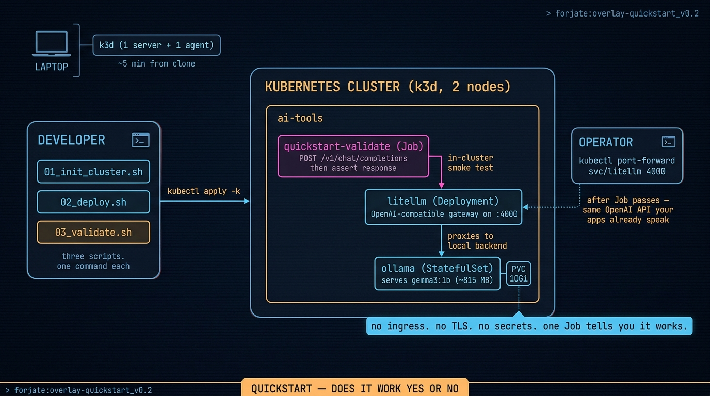

# Overlay: `quickstart`

> The shortest path from `git clone` to a cluster with an LLM answering prompts. No secrets, no OAuth, no cloud accounts.

## The situation

You've just cloned Forjate and you want to know one thing: **does this actually work on my laptop?** Not "is the architecture sound", not "can I deploy LiteLLM with five API keys" — just _stand it up and let me see the LLM say hello_.

The other overlays in the catalog are designed for what comes after that question. `ai-dev-stack` runs a full local AI workbench but expects a Google OAuth app, a Cloudflare DNS token, an LLM provider API key, and five `.env` files you copy from `.env.example`. `bare-metal-starter` assumes you own the metal. `agentic-orchestration` assumes you have a workflow to orchestrate.

`quickstart` exists for the step before all of those: prove the factory composes into a working cluster on a fresh laptop in under half an hour, with zero credentials and one open question — _is the LLM responding?_ The post-deploy validation Job answers that question with a real `/api/generate` round-trip. If the Job exits 0, the quickstart is honest. If it exits non-zero, the failure is on us, not on your setup.

## Architecture



## Components used

| Component | Why |
|-----------|-----|
| `apps/ai-models/ollama` | Single LLM runtime. CPU-friendly, GGUF models, one HTTP API. |
| `quickstart-validate-job.yaml` | In-cluster smoke test — hits `/api/tags` + `/api/generate` end-to-end. |

The overlay deliberately does **not** include the base. Forjate's `base/` mounts `namespaces/ai-tools` with LiteLLM + Open WebUI, both of which need secrets the quickstart avoids. The overlay declares its own minimal namespace and references only what it actually runs.

## `kustomization.yaml`

```yaml
apiVersion: kustomize.config.k8s.io/v1beta1
kind: Kustomization

namespace: ai-tools

resources:
  - namespace.yaml
  - ../../components/apps/ai-models/ollama
  - quickstart-validate-job.yaml

patches:
  - path: patches/ollama-pvc-size.yaml       # 1Gi → 10Gi (model is 7 GB)
    target: { kind: PersistentVolumeClaim, name: pvc-ollama }
  - path: patches/ollama-resources.yaml      # 4Gi → 10Gi RAM limit (OOM at 6Gi)
    target: { kind: StatefulSet, name: ollama }
```

## Notes

- **The default model is `gemma4:e2b-it-q4_K_M`** — Gemma 4 E2B, 7.2 GB on disk, ~8 GB in RAM. Multimodal, so the "Q4" tag is still heavy. For a lighter run, prepend `OLLAMA_MODEL=gemma3:1b` to `02_deploy.sh` and `03_validate.sh` — ~700 MB, ~2 GB RAM, responds in seconds.
- **First prompt is slow on CPU.** Loading a 7 GB model into RAM takes 1-3 min the first time. `02_deploy.sh` warms it during deploy so the validation Job pays only "generate", not "load + generate".
- **`OLLAMA_HOST=0.0.0.0` gotcha.** The Ollama image sets this so `ollama serve` listens on all interfaces. The CLI inherits it and then tries to dial `0.0.0.0` as a client address, which fails. Every `kubectl exec` in `02_deploy.sh` overrides it to `127.0.0.1:11434`.
- **No ingress, no TLS, no auth.** Validation runs entirely inside the cluster (the Job calls `ollama-service.ai-tools.svc.cluster.local`). To talk to the model from your laptop, port-forward — instructions printed by `03_validate.sh`.
- **No persistent volume between runs of `destroy.sh`.** Tearing down deletes the k3d cluster and its volumes, so the next `02_deploy.sh` re-downloads the model. If you iterate often, stop the pod instead of destroying the cluster.

## Reading the validation Job

```bash
kubectl -n ai-tools logs job/quickstart-validate
```

It runs three checks and prints `[PASS]` / `[FAIL]` per check, then a summary. Non-zero exit on any failure. `ttlSecondsAfterFinished: 600` cleans it up automatically.

## Migration path

`quickstart` is a smoke test, not a destination. Once it's green you've confirmed the factory works on your machine — pick the overlay that matches your actual problem:

- A local AI workbench with multiple models and a real UI → [`ai-dev-stack`](./ai-dev-stack.md).
- A first bare-metal cluster with TLS, GitOps, monitoring → [`bare-metal-starter`](./bare-metal-starter.md).
- Chat-first agents with durable workflows → [`agentic-orchestration`](./agentic-orchestration.md).
