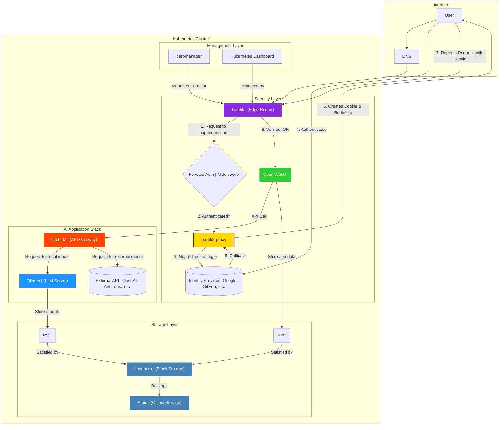

# Service Integration and Architecture Flows

This document describes how the different services in the `forjate` architecture interact with each other to deliver a functional and secure platform.

## High-Level Architecture Diagram

The following diagram illustrates the main interactions between the key components.

## Main Flow Descriptions

### 1. Authenticated User Web Request Flow

This flow describes how a user accesses a protected web application like `Open WebUI` or `Kubernetes Dashboard`.

1.  **Initial Request:** The user navigates to `https://app.tenant.com`.
2.  **Cluster Entry:** Traffic reaches [**Traefik**](./apps/traefik.md), our Ingress Controller.
3.  **Authentication Check:** Traefik, via its `ForwardAuth` middleware, passes the request to [**oauth2-proxy**](./apps/oauth2-proxy.md).
4.  **Redirect to Login (if necessary):** If the user does not have a valid session cookie, `oauth2-proxy` redirects them to the identity provider (e.g., Google) to log in. Once completed, they are redirected back.
5.  **Application Access:** With a valid session, `oauth2-proxy` gives an affirmative response to Traefik, which finally routes the user's request to the target application (e.g., the `Open WebUI` pod).
6.  **Secure Communication:** [**Cert-manager**](./apps/cert-manager.md) has previously provisioned a TLS certificate for `app.tenant.com`, so all communication is over HTTPS.

### 2. AI Stack Request Flow

This flow describes what happens when a user sends a message in the `Open WebUI` chat.

1.  **Submission from Frontend:** The user writes a message in the [**Open WebUI**](./apps/open-webui.md) interface and sends it, selecting a specific model.
2.  **API Gateway Call:** `Open WebUI` does not connect directly to the models. Instead, it makes an API call to [**LiteLLM**](./apps/litellm.md), which acts as a gateway.
3.  **Model Routing:** `LiteLLM` consults its configuration to determine where the requested model is located.
    -   If it's a **local model** (e.g., `ollama/llama3`), it forwards the request to the [**Ollama**](./apps/ollama.md) service.
    -   If it's an **external model** (e.g., `openai/gpt-4`), it makes the call to the corresponding external API.
4.  **Local Model Execution:** If the request goes to `Ollama`, it loads the model (if not already loaded) from its persistent storage and processes the request, generating a response.
5.  **Response Return:** The response travels back the same path (`Ollama` -> `LiteLLM` -> `Open WebUI`) until it is displayed to the user in the interface.

### 3. Persistent Storage and Backup Flow

This flow describes how applications store data persistently and how that data is protected.

1.  **Storage Request (PVC):** A stateful application, like `Ollama` or a database, defines a `PersistentVolumeClaim` (PVC) requesting a certain amount of storage.
2.  **Volume Provisioning (PV):** In a production cluster, [**Longhorn**](./apps/longhorn.md) detects this PVC and dynamically provisions a `PersistentVolume` (PV) to satisfy it. The volume is automatically replicated across multiple cluster nodes to ensure high availability.
3.  **Scheduled Backup:** Longhorn runs scheduled backup jobs for critical volumes.
4.  **Backup Target:** The backups are sent to a bucket in our object storage server, [**Minio**](./apps/minio.md). This decouples the backups from the primary block storage, providing an additional layer of security for disaster recovery.
