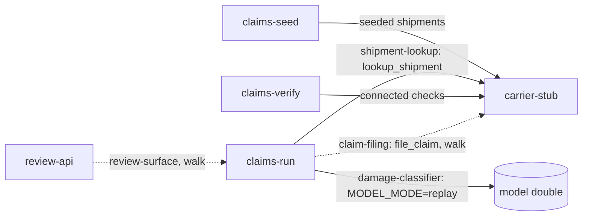

# How parcel-claims connects

```mermaid
graph LR
  claims-seed -->|seeded shipments| carrier-stub
  claims-run -->|shipment-lookup: lookup_shipment| carrier-stub
  claims-run -->|damage-classifier: MODEL_MODE=replay| model[(model double)]
  claims-verify -->|connected checks| carrier-stub
  review-api -.->|review-surface, walk| claims-run
  claims-run -.->|claim-filing: file_claim, walk| carrier-stub
```
